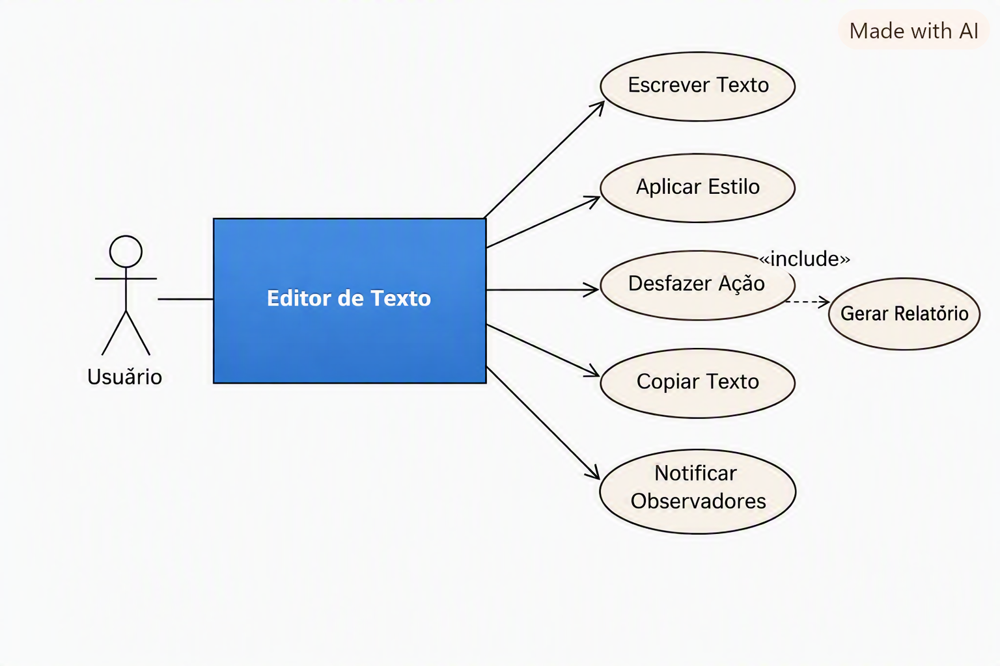
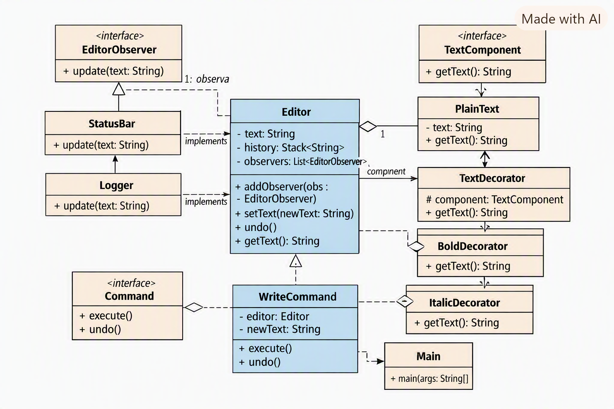

# DesignLab - Editor com Padrões de Projeto

Este projeto demonstra a aplicação combinada dos padrões **Observer**, **Decorator** e **Command** em Java puro.  
O objetivo é criar um editor simples que permita executar comandos, aplicar estilos ao texto e notificar observadores sobre mudanças.

---

## 📂 Estrutura do Projeto
src/
└── editor/
├── command/
│     ├── Command.java
│     └── WriteCommand.java
│
├── decorator/
│     ├── TextComponent.java
│     ├── PlainText.java
│     ├── TextDecorator.java
│     ├── BoldDecorator.java
│     └── ItalicDecorator.java
│
├── observer/
│     ├── EditorObserver.java
│     ├── StatusBar.java
│     └── Logger.java
│
└── core/
├── Editor.java
└── Main.java

---

## 🎯 Justificativa da Divisão

- **command/** → encapsula ações do editor (escrever, desfazer).  
  - Segue o princípio de **Command Pattern**, isolando cada ação em uma classe.  
- **decorator/** → permite adicionar estilos ao texto dinamicamente.  
  - Segue o princípio de **Decorator Pattern**, promovendo flexibilidade sem alterar a classe base.  
- **observer/** → mantém observadores que reagem a mudanças no editor.  
  - Segue o princípio de **Observer Pattern**, garantindo baixo acoplamento entre editor e notificações.  
- **core/** → núcleo da aplicação, responsável por coordenar os padrões.  
  - Contém `Editor` (estado e lógica central) e `Main` (ponto de entrada).

Essa divisão segue o método de **separação de responsabilidades** (Single Responsibility Principle), garantindo que cada pacote e classe tenha uma função única e clara.

---

## 🧩 Classes e Responsabilidades

### Observer
- **EditorObserver (interface)**  
  - Método: `update(String text)` → chamado quando o texto muda.  
- **StatusBar (classe)**  
  - Responsabilidade: exibir o texto atualizado no console.  
- **Logger (classe)**  
  - Responsabilidade: registrar mudanças no texto.

### Decorator
- **TextComponent (interface)**  
  - Método: `getText()` → retorna o texto atual.  
- **PlainText (classe)**  
  - Responsabilidade: representar texto simples sem formatação.  
- **TextDecorator (classe abstrata)**  
  - Responsabilidade: base para decoradores, mantém referência ao componente.  
- **BoldDecorator (classe)**  
  - Responsabilidade: aplicar estilo **negrito**.  
- **ItalicDecorator (classe)**  
  - Responsabilidade: aplicar estilo **itálico**.

### Command
- **Command (interface)**  
  - Métodos:  
    - `execute()` → executa a ação.  
    - `undo()` → desfaz a última ação.  
- **WriteCommand (classe)**  
  - Responsabilidade: escrever novo texto no editor.  
- **Editor (classe)**  
  - Responsabilidade: manter o estado do texto, histórico e observadores.  
  - Métodos:  
    - `addObserver(EditorObserver obs)` → adiciona observador.  
    - `setText(String newText)` → altera texto e notifica observadores.  
    - `undo()` → desfaz última alteração.  
    - `getText()` → retorna texto atual.  
- **Main (classe)**  
  - Responsabilidade: ponto de entrada, demonstra uso dos padrões.  

---

## 📊 Diagrama de Caso de Uso

### O que o diagrama mostra
- **Ator principal:** `Usuário` — representa quem interage com o sistema.
- **Sistema:** `Editor de Texto` — o núcleo que executa as ações.
- **Casos de uso:**
  - **Escrever Texto** → ação principal do usuário.
  - **Aplicar Estilo** → uso dos decoradores (Bold, Italic, etc.).
  - **Desfazer Ação** → uso do Command Pattern (undo).
  - **Copiar Texto** → poderia ser implementado como outro comando.
  - **Notificar Observadores** → uso do Observer Pattern.
- **Relacionamento include:** `Aplicar Estilo` inclui `Gerar Relatório`, mostrando que aplicar estilos pode ser parte de uma funcionalidade maior.
---

## 🧠 Diagrama de Classes UML

### O que o diagrama mostra
- **Observer:**
  - `EditorObserver` (interface) → implementada por `StatusBar` e `Logger`.
- **Decorator:**
  - `TextComponent` (interface) → implementada por `PlainText`.
  - `TextDecorator` (classe abstrata) → estendida por `BoldDecorator` e `ItalicDecorator`.
- **Command:**
  - `Command` (interface) → implementada por `WriteCommand`.
- **Core:**
  - `Editor` → mantém estado, histórico e observadores.
  - `Main` → ponto de entrada da aplicação.
---

## 🚀 Execução

1. Compile o projeto no IntelliJ IDEA.  
2. Execute a classe `Main`.  
3. Observe no console:  
   - Texto escrito.  
   - Texto decorado com estilos.  
   - Observadores reagindo às mudanças.  
   - Ação de **undo** funcionando.

---

## 📌 Conclusão

Este projeto mostra como diferentes padrões de projeto podem ser combinados para criar uma aplicação modular, extensível e de fácil manutenção.  
Cada classe tem uma **única responsabilidade**, e a divisão em pacotes reflete a separação lógica dos padrões aplicados.
